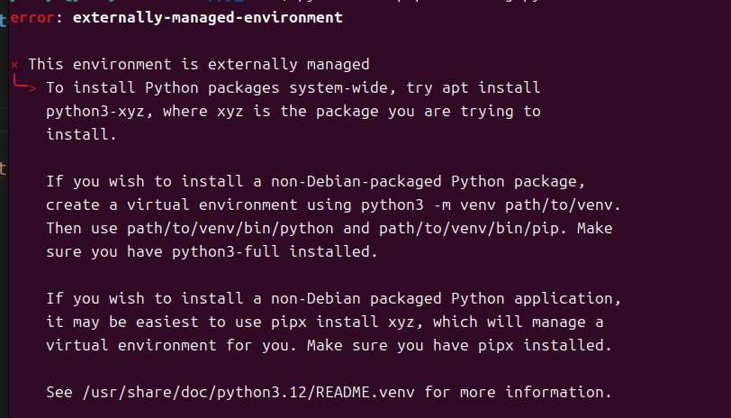
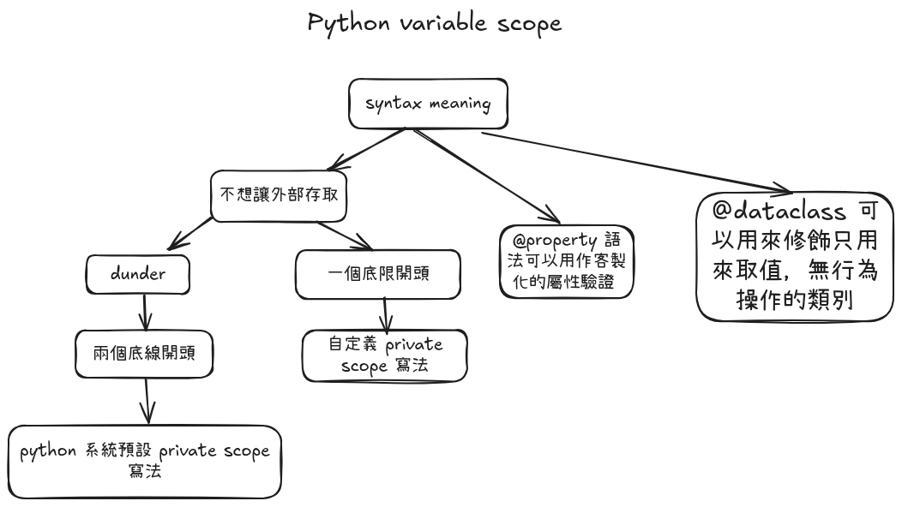
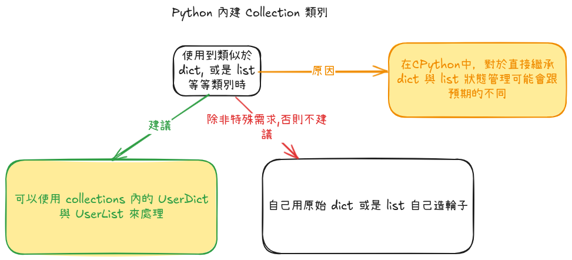
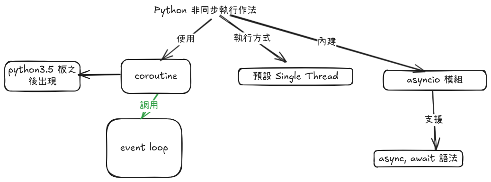
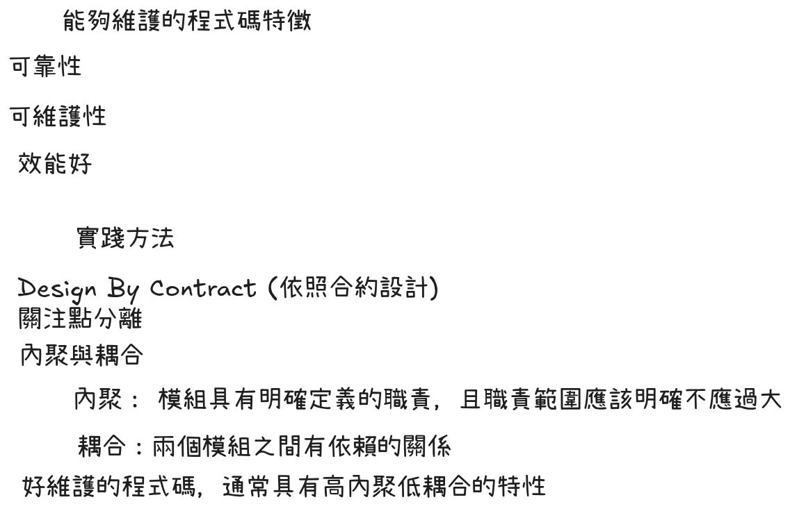
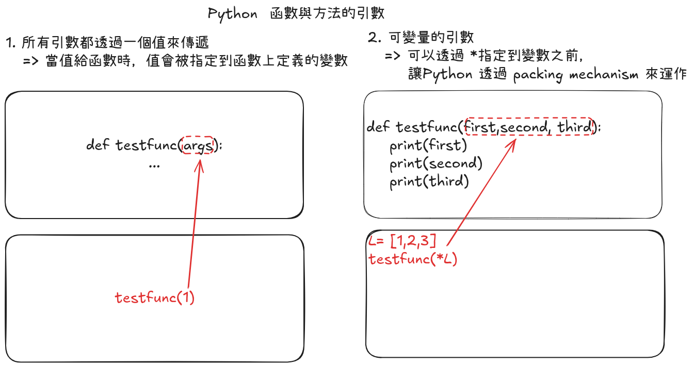

# python clean code concept

## how to enable install jupyter runtime

### Problem



### Solution

use venv without breaking original system python3

1. install relative python version virtual environment
```shell
sudo apt install python3.12-venv
```
2. setup venv environment config
```shell
python3 -m venv py_envs
```
3. activative venv
```shell
source py_envs/bin/activate
```
4. install jupyter
```shell
python3 -m pip install jupyter
```
5. start work with jupyter notebook
```shell
jupyter-notebook
```
## python　私有變數域　



## python 內建 Collection

## python 非同步語法



## 程式碼設計概念



## Python 的函數與方法



## 設定 uv

```shell
uv init
```

## 安裝已經安裝過得 package

```shell
uv add -r requirements.txt
```

## 執行 jupyter notebook

```shell
uv run jupyter notebook
```